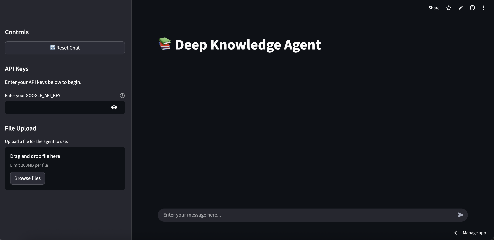
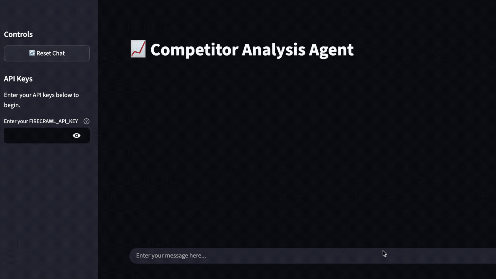
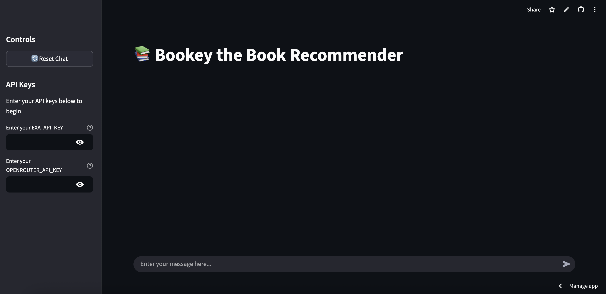
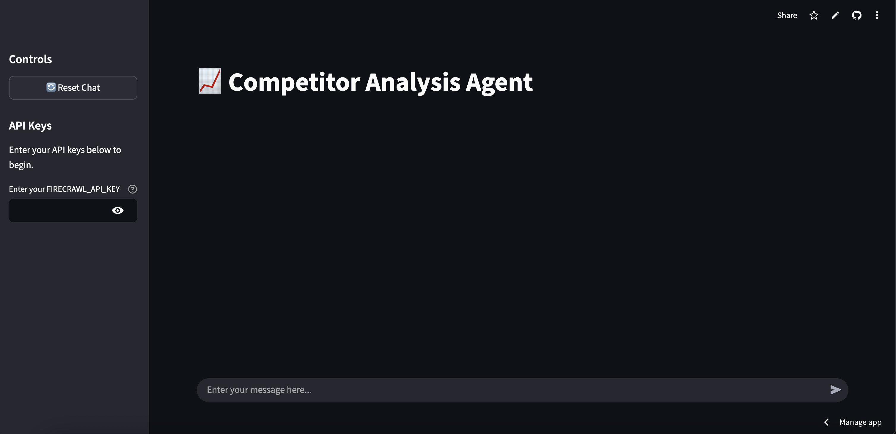
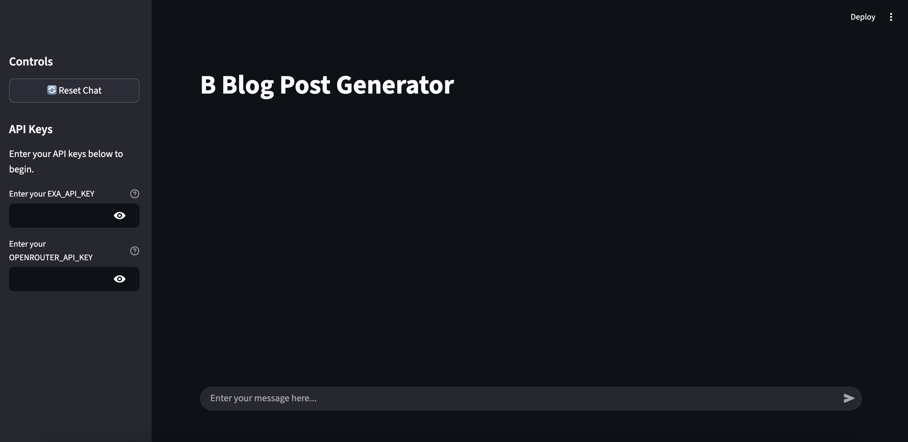
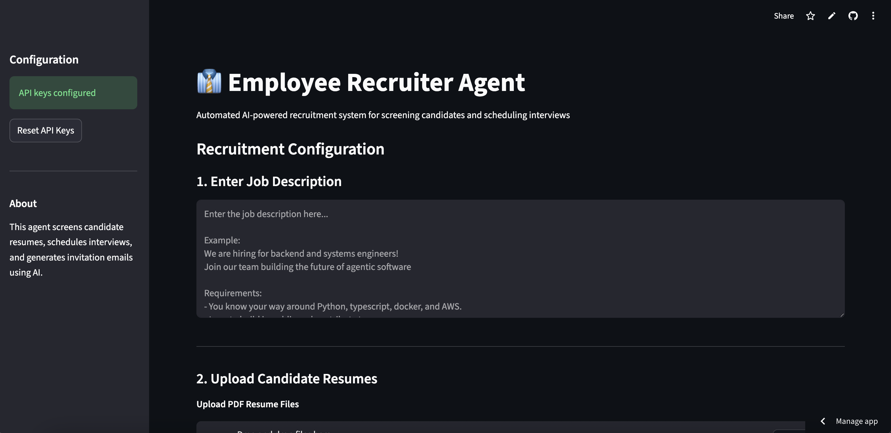
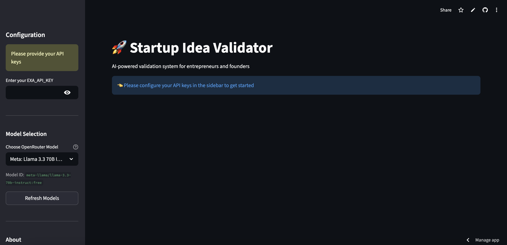

# Enterprise AI Agents 🤖

<div align="center">


**Production-ready AI agents for enterprise automation** • Built with modern AI frameworks • Deployed on Streamlit

[Explore Agents](#-ai-agent-showcase) • [Quick Start](#-quick-start) • [Contributing](#-contributing)

</div>

---

## 📋 Table of Contents

- [Overview](#-overview)
- [All Agents (Quick View)](#-all-agents-quick-view)
- [AI Agent Showcase](#-ai-agent-showcase)
- [Quick Start](#-quick-start)
- [Project Structure](#-project-structure)
- [Technologies Used](#-technologies-used)
- [Contributing](#-contributing)
- [Contact](#-contact)
- [License](#-license)

---

## 🎯 Overview

This repository is a comprehensive collection of **8 production-ready AI agents** designed to solve real-world enterprise problems. Each agent is a fully functional, deployable application built with cutting-edge AI frameworks and best practices.

### Key Highlights

- **Multi-Agent Systems**: Specialized agents working together to solve complex tasks
- **Real-World Applications**: From customer support to competitive analysis
- **Production Ready**: Deployed applications with live demos
- **Modern Stack**: Built with Agno, LangGraph, OpenAI, and more
- **Open Source**: MIT licensed, ready to customize and deploy

### Categories

- **Business Intelligence** (2 agents)
- **Content Creation** (1 agents)
- **Customer Support** (1 agents)
- **Recommendations** (2 agents)
- **Recruitment** (1 agents)
- **Research & Analysis** (1 agents)

---

## 🔍 All Agents (Quick View)

<div align="center">

| # | Agent | Category | Status | Quick Links |
|---|-------|----------|--------|-------------|
| 1 | 📚 **Deep Knowledge Agent** | Research & Analysis | 🟢 Live | [Demo](https://deep-knowledge-agent.streamlit.app/) • [Docs](1_deep_knowledge_agent/README.md) • [Code](1_deep_knowledge_agent) |
| 2 | 🏠 **Airbnb Listing Finder Agent** | Recommendations | 🟢 Live | [Demo](https://airbnb-listing-finder-agent.streamlit.app/) • [Docs](2_airbnb_listing_finder_agent/README.md) • [Code](2_airbnb_listing_finder_agent) |
| 3 | 💬 **Customer Support Agent** | Customer Support | 🔵 Local | [Docs](3-customer-support-agent/README.md) • [Code](3-customer-support-agent) |
| 4 | 📖 **Bookey - The Book Recommender Agent** | Recommendations | 🟢 Live | [Demo](https://bookey-the-book-recommender-agent.streamlit.app/) • [Docs](4-bookey_the_book_recommender_agent/README.md) • [Code](4-bookey_the_book_recommender_agent) |
| 5 | 🔍 **Competitor Analysis Agent** | Business Intelligence | 🟢 Live | [Demo](https://competitor-analysis-agent.streamlit.app/) • [Docs](5_competitor_analysis_agent/README.md) • [Code](5_competitor_analysis_agent) |
| 6 | ✍️ **Blog Post Generator Agent** | Content Creation | 🟢 Live | [Demo](https://blog-post-generator-agent.streamlit.app/) • [Docs](6_blog_post_generator_agent/README.md) • [Code](6_blog_post_generator_agent) |
| 7 | 👔 **Employee Recruiter Agent** | Recruitment | 🟢 Live | [Demo](https://employee-recruiter-agent.streamlit.app/) • [Docs](7_employee_recruiter_agent/README.md) • [Code](7_employee_recruiter_agent) |
| 8 | 🚀 **Startup Idea Validator** | Business Intelligence | 🟢 Live | [Demo](https://startup-idea-validator.streamlit.app/) • [Docs](8_startup_idea_validator/README.md) • [Code](8_startup_idea_validator) |

</div>

---

## 🚀 AI Agent Showcase

<div align="center">

**Click on any card to explore the live demo or dive into the source code!**

</div>

<table>
  <tr>
    <td width="33%" valign="top">
<div align="center" style="margin: 20px;">
  <h3>📚 Deep Knowledge Agent</h3>
  <a href="https://deep-knowledge-agent.streamlit.app/" target="_blank">
    
  </a>
  
  <p align="left"><strong>Performs iterative searches through knowledge base, breaking down complex queries into sub-questions for comprehensive answers.</strong></p>
  
  <p align="left">
    <strong>Category:</strong> Research & Analysis<br/>
    <strong>Impact:</strong> Drastically reduces research time<br/>
  </p>
  
  <p align="left">
    
    
    
    
  </p>
  
  <p align="center">
    <a href="https://deep-knowledge-agent.streamlit.app/" target="_blank">
      
    </a>
    <a href="1_deep_knowledge_agent/README.md">
      
    </a>
    <a href="1_deep_knowledge_agent">
      
    </a>
  </p>
</div>
    </td>
    <td width="33%" valign="top">
<div align="center" style="margin: 20px;">
  <h3>🏠 Airbnb Listing Finder Agent</h3>
  <a href="https://airbnb-listing-finder-agent.streamlit.app/" target="_blank">
    
  </a>
  
  <p align="left"><strong>AI agent that finds Airbnb listings based on natural language queries, searches and filters listings, and presents top 10 recommendations.</strong></p>
  
  <p align="left">
    <strong>Category:</strong> Recommendations<br/>
    <strong>Impact:</strong> 90% reduction in search time<br/>
  </p>
  
  <p align="left">
    
    
    
    
  </p>
  
  <p align="center">
    <a href="https://airbnb-listing-finder-agent.streamlit.app/" target="_blank">
      
    </a>
    <a href="2_airbnb_listing_finder_agent/README.md">
      
    </a>
    <a href="2_airbnb_listing_finder_agent">
      
    </a>
  </p>
</div>
    </td>
    <td width="33%" valign="top">
<div align="center" style="margin: 20px;">
  <h3>💬 Customer Support Agent</h3>
  
  
  <p align="left"><strong>Intelligent customer support agent that categorizes queries, analyzes sentiment, and provides appropriate responses or escalates issues.</strong></p>
  
  <p align="left">
    <strong>Category:</strong> Customer Support<br/>
    <strong>Impact:</strong> Automates tier-1 support<br/>
  </p>
  
  <p align="left">
    
    
    
    
  </p>
  
  <p align="center">
    <a href="3-customer-support-agent/README.md">
      
    </a>
    <a href="3-customer-support-agent">
      
    </a>
  </p>
</div>
    </td>
  </tr>
  <tr>
    <td width="33%" valign="top">
<div align="center" style="margin: 20px;">
  <h3>📖 Bookey - The Book Recommender Agent</h3>
  <a href="https://bookey-the-book-recommender-agent.streamlit.app/" target="_blank">
    
  </a>
  
  <p align="left"><strong>AI-powered literary curator that provides personalized book recommendations based on reading preferences and favorite titles.</strong></p>
  
  <p align="left">
    <strong>Category:</strong> Recommendations<br/>
    <strong>Impact:</strong> 80% reduction in book search time<br/>
  </p>
  
  <p align="left">
    
    
    
    
  </p>
  
  <p align="center">
    <a href="https://bookey-the-book-recommender-agent.streamlit.app/" target="_blank">
      
    </a>
    <a href="4-bookey_the_book_recommender_agent/README.md">
      
    </a>
    <a href="4-bookey_the_book_recommender_agent">
      
    </a>
  </p>
</div>
    </td>
    <td width="33%" valign="top">
<div align="center" style="margin: 20px;">
  <h3>🔍 Competitor Analysis Agent</h3>
  <a href="https://competitor-analysis-agent.streamlit.app/" target="_blank">
    
  </a>
  
  <p align="left"><strong>Automates competitive analysis by identifying competitors, scraping websites, and generating comprehensive strategic reports with SWOT analysis.</strong></p>
  
  <p align="left">
    <strong>Category:</strong> Business Intelligence<br/>
    <strong>Impact:</strong> 95% reduction in research time<br/>
  </p>
  
  <p align="left">
    
    
    
    
  </p>
  
  <p align="center">
    <a href="https://competitor-analysis-agent.streamlit.app/" target="_blank">
      
    </a>
    <a href="5_competitor_analysis_agent/README.md">
      
    </a>
    <a href="5_competitor_analysis_agent">
      
    </a>
  </p>
</div>
    </td>
    <td width="33%" valign="top">
<div align="center" style="margin: 20px;">
  <h3>✍️ Blog Post Generator Agent</h3>
  <a href="https://blog-post-generator-agent.streamlit.app/" target="_blank">
    
  </a>
  
  <p align="left"><strong>Multi-agent content creation pipeline that transforms topics into complete content suites: research, blog post, LinkedIn post, and Twitter thread.</strong></p>
  
  <p align="left">
    <strong>Category:</strong> Content Creation<br/>
    <strong>Impact:</strong> Automated end-to-end content creation<br/>
  </p>
  
  <p align="left">
    
    
    
    
  </p>
  
  <p align="center">
    <a href="https://blog-post-generator-agent.streamlit.app/" target="_blank">
      
    </a>
    <a href="6_blog_post_generator_agent/README.md">
      
    </a>
    <a href="6_blog_post_generator_agent">
      
    </a>
  </p>
</div>
    </td>
  </tr>
  <tr>
    <td width="33%" valign="top">
<div align="center" style="margin: 20px;">
  <h3>👔 Employee Recruiter Agent</h3>
  <a href="https://employee-recruiter-agent.streamlit.app/" target="_blank">
    
  </a>
  
  <p align="left"><strong>Automated AI-powered recruitment system from resume screening to interview scheduling and email communications.</strong></p>
  
  <p align="left">
    <strong>Category:</strong> Recruitment<br/>
    <strong>Impact:</strong> Automates screening and scheduling<br/>
  </p>
  
  <p align="left">
    
    
    
    
  </p>
  
  <p align="center">
    <a href="https://employee-recruiter-agent.streamlit.app/" target="_blank">
      
    </a>
    <a href="7_employee_recruiter_agent/README.md">
      
    </a>
    <a href="7_employee_recruiter_agent">
      
    </a>
  </p>
</div>
    </td>
    <td width="33%" valign="top">
<div align="center" style="margin: 20px;">
  <h3>🚀 Startup Idea Validator</h3>
  <a href="https://startup-idea-validator.streamlit.app/" target="_blank">
    
  </a>
  
  <p align="left"><strong>Validates startup ideas through AI-powered multi-phase analysis with market research, competitive analysis, and strategic recommendations.</strong></p>
  
  <p align="left">
    <strong>Category:</strong> Business Intelligence<br/>
    <strong>Impact:</strong> 95% time reduction (weeks to minutes)<br/>
  </p>
  
  <p align="left">
    
    
    
    
  </p>
  
  <p align="center">
    <a href="https://startup-idea-validator.streamlit.app/" target="_blank">
      
    </a>
    <a href="8_startup_idea_validator/README.md">
      
    </a>
    <a href="8_startup_idea_validator">
      
    </a>
  </p>
</div>
    </td>
    <td width="33%"></td>
  </tr>
</table>

---

## 🏁 Quick Start

### Prerequisites

- Python 3.9 or higher
- [uv](https://github.com/astral-sh/uv) (recommended) or pip
- API keys for respective services (OpenAI, OpenRouter, etc.)

### Running an Agent

1. **Clone the repository:**
   ```bash
   git clone https://github.com/bhanuchaddha/enterprise-ai-agents.git
   cd enterprise-ai-agents
   ```

2. **Navigate to an agent directory:**
   ```bash
   cd <agent_folder_name>
   ```

3. **Install dependencies:**
   ```bash
   uv sync  # or: pip install -r requirements.txt
   ```

4. **Set up environment variables:**
   Create a `.env` file with required API keys (see agent's README for specifics)

5. **Run the Streamlit app:**
   ```bash
   streamlit run streamlit_app.py
   ```

---

## 📁 Project Structure

```
enterprise-ai-agents/
├── 1_deep_knowledge_agent/
│   ├── documentation/
│   │   ├── assets/
│   │   │   └── demo.png (or .gif, .jpg, .jpeg)
│   │   └── display-info.json
│   ├── streamlit_app.py
│   ├── README.md
│   └── pyproject.toml
├── 2_airbnb_listing_finder_agent/
│   └── ...
├── common/
│   └── shared utilities
├── generate_readme.py
└── README.md (this file)
```

Each agent directory contains:
- **documentation/**: Agent metadata and demo assets
  - **display-info.json**: Configuration for README generation
  - **assets/demo.png** (or .gif, .jpg, .jpeg): Demo image for showcase
- **streamlit_app.py**: Web UI application
- **README.md**: Detailed agent documentation
- **pyproject.toml**: Python dependencies

---

## 🛠 Technologies Used

This project leverages cutting-edge AI and development tools:

### AI Frameworks
- **Agno**: Multi-agent orchestration framework
- **LangGraph**: Graph-based agent workflows
- **LangChain**: LLM application development

### LLM Providers
- **OpenAI**: GPT-4, GPT-3.5, embeddings
- **OpenRouter**: Multi-model access (Claude, Gemini, Llama, etc.)

### Tools & Services
- **Streamlit**: Interactive web applications
- **LanceDB**: Vector database for embeddings
- **Exa API**: Advanced web search and research
- **MCP (Model Context Protocol)**: Tool integration

### Infrastructure
- **Python 3.9+**: Core programming language
- **uv**: Fast Python package manager
- **SQLite**: Local data persistence

---

## 🤝 Contributing

We welcome contributions! Here's how to add a new agent:

### Adding a New Agent

1. **Create agent directory:**
   ```bash
   mkdir <your_agent_name>
   cd <your_agent_name>
   ```

2. **Create directory structure:**
   ```bash
   mkdir -p documentation/assets
   ```

3. **Add your demo image:**
   - Place your demo image at `documentation/assets/demo.png` (or `.gif`, `.jpg`, `.jpeg`)
   - Supported formats: PNG, GIF, JPG, JPEG
   - Recommended: 800x600 or 1024x768, < 5MB

4. **Create display-info.json:**
   ```bash
   cp ../display-info-schema.json documentation/display-info.json
   ```
   Fill in your agent's details (see schema for required fields)

5. **Implement your agent:**
   - Add your agent code
   - Create `streamlit_app.py` for UI
   - Write detailed `README.md`

6. **Regenerate main README:**
   ```bash
   python generate_readme.py
   ```

7. **Submit a pull request!**

### Contribution Guidelines

- Follow existing code structure and naming conventions
- Include comprehensive documentation
- Add demo GIF or video
- Test your agent thoroughly
- Update display-info.json with accurate information

---

## 👤 Contact

**Bhanu Chaddha**

- LinkedIn: [linkedin.com/in/bhanu-chaddha](https://www.linkedin.com/in/bhanu-chaddha/)
- GitHub: [@bhanuchaddha](https://github.com/bhanuchaddha)

---

## 📄 License

This project is licensed under the **MIT License** - see the [LICENSE](LICENSE) file for details.

---

<div align="center">

**⭐ Star this repo if you find it useful! ⭐**

Made with ❤️ by [Bhanu Chaddha](https://www.linkedin.com/in/bhanu-chaddha/)

</div>
